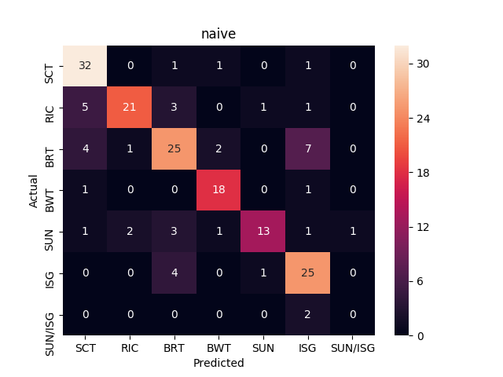
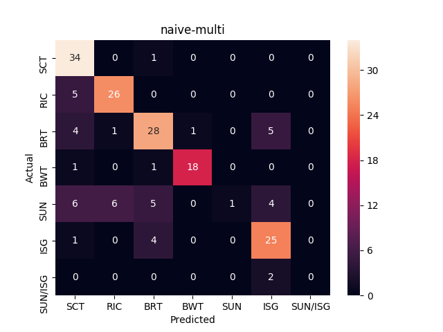

# Klettgau's SYNCOIN Classification

My first exploration of basic statistical analysis techniques and a primitive neural network in order to classify messages utilizing sklearn and Keras.
The messages used in the project represent reports or data that NATO forces would provide after conducting patrols in a given area. The messages are representative
of operations in a counter insurgency environemnt (COIN) rather than a peer on peer force. The data set  is further described in the [paper]
by  J. L. Graham, J. Rimland, and D. L. Hall, "A COIN-inspired synthetic data set for qualitative evaluation of hard and soft fusion systems".


[paper]:http://fusion.isif.org/proceedings/Fusion_2011/data/papers/132.pdf?

## Getting Started
The package is built using python3.5 .
```
pip install requirements.txt  
```

[//]: # (### A valid markdown comment but it appears to be only one line)

## Deployment
The first file was an exploration and introduction to Sklearn's built in statsical packages and techniques in order to  classify the messages.
It will generate several graphics to represent the findings and accuracy of the techniques in an informative format.Additionally, it was the first
foray into Stats and primitive data analysis that I have attempted.
```
python3 stats.py
```
The second file consists of my first  neural network created in order to classify the provided messages.The file contains the first attempt
at designing a network and the second iteration after additional research.The accuracy improved roughly four times between the two iterations.

```
python3 syncoin.py
```
## Results
This project exposed myself to many different libraries , clustering techniques and  visual aides available in python.

### Neural Network Confusion Matrix
 The Y-axis is the actual label of the given message and the X-axis is the predicted label from the network.The network performed on par or
 slightly better than the basic stats techniques from sklearn.


### Naive Bayes
Gaussian Naive Bayes was employed and then compared to Multinomial Naive Bayes.


### Logistic Regression

### Support Vector Machine

### Clustering
In the begining phases of the project, I utilized kmeans clustering in order to explore the data and investigate
any possible relations or overlap in the set.A cursory glance was given to Agglomerative and Affinity Clustering.The big take away
from these techniques are the hyper-parameters of each function can heavily influence the outcome of the analysis.[Wattenberg, et al] has a great
article that visualizes the common issues that can occur with t-SNE.

[Wattenberg, et al]:https://distill.pub/2016/misread-tsne/
#### K-Means
With minimal tuning of the hyper-parameters, the clustering supports the notion that  message types can overlap such as ISG and SUN/ISG.The black X
represents the center of each cluster.The Dendrogram is based off of the same K-means clustering output and it visualizes the merging of the clusters
and the distance between each iteration.


#### Agglomerative and Affinity
These two techniques weren't explored as much as k-means due to my unfamiliarity with the purpose of  the hyper-parameters.
and sklearn at the time.


## Authors

* **Klettgau** - *Initial work*

## Acknowledgements
* **[Joernhees]** - *Execellent resource for sklearn as well as the fancy dendrogram visual.*

[Joernhees]:https://joernhees.de/blog/2015/08/26/scipy-hierarchical-clustering-and-dendrogram-tutorial/
## License

This project is licensed under the MIT License - see the [LICENSE.md](LICENSE.md) file for details

[//]: # (## Acknowledgments)


